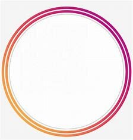

<html lang="en">
<head>
    <meta charset="UTF-8">
    <link rel="stylesheet" href="css/css.css">
</head>
<body>
    

        
hotline. (+84)12-3456-7890
 
    

    <nav class="menu">
        

        <ul>
            <li><a href="assignment.html">Trang chủ</a></li>
            <li><a href="ass/banthan.html" >Giới thiệu</a></li>
            <li><a href="ass/duan.html">Dự Án</a>
                <ul>
                    <li><a href="ass/duan1.html" >Dự án 1</a></li>
                    <li><a href="ass/duan2.html" >Dự án 2</a></li>
                </ul>
             </li> 
            <li><a href="ass/lienhe.html">Liên hệ</a></li>
            <li><a href="ass/hoidap.html">Hỏi đáp</a></li>
        </ul>
    </nav>
    <header></header>
    <article>
            

            
 Dự án Mẫu 
 
            

                
                    Dự án 1  
                    Dự án Nam Hội An City là dự án duy nhất có vị trí tuyệt đẹp nằm ven sông Thu Bồn, thuộc phía Nam chân cầu Cửa Đại, xã Duy Nghĩa, huyện Duy Xuyên, tỉnh Quảng Nam....
                

                

                    
                        Dự án 1  
                        Dự án Nam Hội An City là dự án duy nhất có vị trí tuyệt đẹp nằm ven sông Thu Bồn, thuộc phía Nam chân cầu Cửa Đại, xã Duy Nghĩa, huyện Duy Xuyên, tỉnh Quảng Nam....
                    

                    

                        
                            Dự án 1  
                            Dự án Nam Hội An City là dự án duy nhất có vị trí tuyệt đẹp nằm ven sông Thu Bồn, thuộc phía Nam chân cầu Cửa Đại, xã Duy Nghĩa, huyện Duy Xuyên, tỉnh Quảng Nam....
                        

                        

                            
                                Dự án 1  
                                Dự án Nam Hội An City là dự án duy nhất có vị trí tuyệt đẹp nằm ven sông Thu Bồn, thuộc phía Nam chân cầu Cửa Đại, xã Duy Nghĩa, huyện Duy Xuyên, tỉnh Quảng Nam....
                            

            

    </article>
    <aside>
            
 Dự án Mẫu  
 
            

                
                    Dự án 1  
                    Dự án Nam Hội An City là dự án duy nhất có vị trí tuyệt đẹp nằm ven sông Thu Bồn, thuộc phía Nam chân cầu Cửa Đại, xã Duy Nghĩa, huyện Duy Xuyên, tỉnh Quảng Nam....
                

                

                    
                        Dự án 1  
                        Dự án Nam Hội An City là dự án duy nhất có vị trí tuyệt đẹp nằm ven sông Thu Bồn, thuộc phía Nam chân cầu Cửa Đại, xã Duy Nghĩa, huyện Duy Xuyên, tỉnh Quảng Nam....
                    

                    

                        
                            Dự án 1  
                            Dự án Nam Hội An City là dự án duy nhất có vị trí tuyệt đẹp nằm ven sông Thu Bồn, thuộc phía Nam chân cầu Cửa Đại, xã Duy Nghĩa, huyện Duy Xuyên, tỉnh Quảng Nam....
                        

                        

                            
                                Dự án 1  
                                Dự án Nam Hội An City là dự án duy nhất có vị trí tuyệt đẹp nằm ven sông Thu Bồn, thuộc phía Nam chân cầu Cửa Đại, xã Duy Nghĩa, huyện Duy Xuyên, tỉnh Quảng Nam....
                            

                            

                                
                                    Dự án 1  
                                    Dự án Nam Hội An City là dự án duy nhất có vị trí tuyệt đẹp nằm ven sông Thu Bồn, thuộc phía Nam chân cầu Cửa Đại, xã Duy Nghĩa, huyện Duy Xuyên, tỉnh Quảng Nam....
                                

                                

                                    
                                        Dự án 1  
                                        Dự án Nam Hội An City là dự án duy nhất có vị trí tuyệt đẹp nằm ven sông Thu Bồn, thuộc phía Nam chân cầu Cửa Đại, xã Duy Nghĩa, huyện Duy Xuyên, tỉnh Quảng Nam....
                                    

                                    

                                        
                                            Dự án 1  
                                            Dự án Nam Hội An City là dự án duy nhất có vị trí tuyệt đẹp nằm ven sông Thu Bồn, thuộc phía Nam chân cầu Cửa Đại, xã Duy Nghĩa, huyện Duy Xuyên, tỉnh Quảng Nam....
                                        

                                        

                                            
                                                Dự án 1  
                                                Dự án Nam Hội An City là dự án duy nhất có vị trí tuyệt đẹp nằm ven sông Thu Bồn, thuộc phía Nam chân cầu Cửa Đại, xã Duy Nghĩa, huyện Duy Xuyên, tỉnh Quảng Nam....
                                            

    </aside>
    <footer>
        

        Thông tin liên hệ  
        Cơ sở Hồ Chí Minh  
        391A Nam Kỳ Khởi Nghĩa, Q. 3, TP. Hồ Chí Minh 
        778/B1 Nguyễn Kiệm, P.4, Q. Phú Nhuận, TP. Hồ Chí Minh 
        Toà nhà Innovation, lô 24, Công viên phần mềm Quang Trung, Quận 12, Hồ Chí Minh 
        (028) 3526 8799 – (028) 62523434
        

    </footer>
    

        
    

    
</body>
</html>

